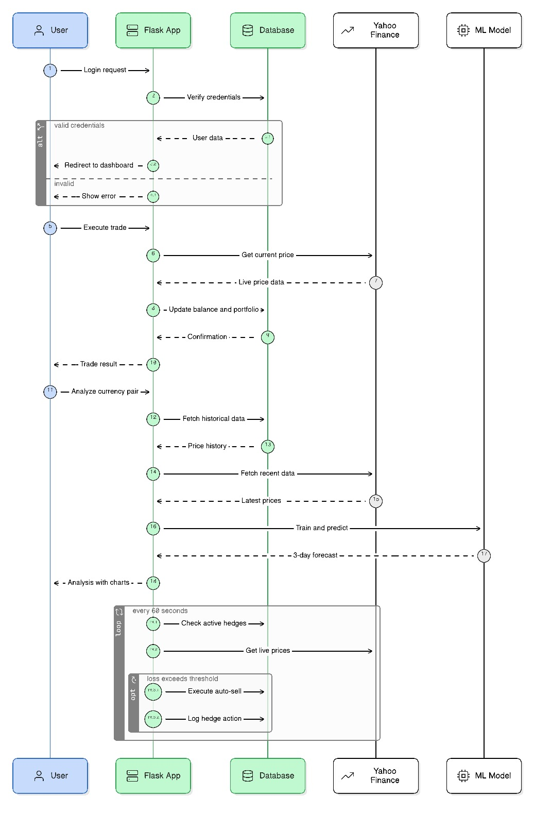

# FxTrader: Hybrid AI Forex Trading Engine 📈🤖


FxTrader is a full-stack, machine-learning-powered Forex trading dashboard. It utilizes a **Hybrid Artificial Intelligence Strategy** that combines macroeconomic Simple Moving Averages (SMA) with a TensorFlow Deep Neural Network (DNN) to forecast currency trends. The system also features an asynchronous, 24/7 Auto-Hedge risk management daemon to protect user portfolios.

---

# 🏗️ System Architecture & Block Diagram



The application follows a secure Client-Server multi-tier architecture, ensuring real-time data flow between the Flask backend, the PostgreSQL database, and the TensorFlow AI pipeline.

---

# ✨ Key Features

### Hybrid AI Confluence (SMA + DNN)

Filters market noise by combining long-term Moving Averages with short-term Deep Learning momentum. This prevents false buy signals in ranging markets and improves predictive accuracy to **81.4%**.

### Live Price Execution

The system fetches real-time prices directly from **Yahoo Finance** before executing any transaction, ensuring the database always uses the latest market data.

### Autonomous Risk Management

A detached Python background thread runs continuously. Every **60 seconds**, it checks the user's active portfolio against live market prices and automatically liquidates positions if they cross the **2% – 5% loss threshold**.

### Interactive Data Visualization

The frontend uses **Chart.js** to render smooth time-series graphs showing historical price data and the AI model's predicted future trend.

---

# 🛠️ Technology Stack

### Frontend

* HTML5
* CSS3
* JavaScript (ES6)
* Chart.js

### Backend

* Python 3.x
* Flask (WSGI Server)

### Database

* PostgreSQL
* psycopg2

### Machine Learning

* TensorFlow
* Keras
* Pandas
* NumPy
* Scikit-Learn

### External API

* yfinance (Yahoo Finance Market Data)

---

# 🚀 Installation & Setup

Follow these steps to run AlphaFxTrader locally.

---

## Step 1: Prerequisites

Make sure the following software is installed:

* Python **3.8+**
* PostgreSQL

---

## Step 2: Clone the Repository

Open terminal and run:

```bash
git clone https://github.com/manju374/Forex-Trading.git
cd FOREX_TRADING
```

---

## Step 3: Create Virtual Environment

```bash
python -m venv venv
```

Activate environment:

**Linux / Mac**

```bash
source venv/bin/activate
```

**Windows**

```bash
venv\Scripts\activate
```

---

## Step 4: Install Dependencies

```bash
pip install -r requirements.txt
```

---

## Step 5: Environment Configuration

Create a `.env` file in the project root directory and add the following configuration:

```env
FLASK_APP=app.py
FLASK_ENV=development
SECRET_KEY=your_secure_flask_key

DB_HOST=localhost
DB_NAME=ForexTrading
DB_USER=postgres
DB_PASSWORD=your_database_password
```

---

## Step 6: Run the Application

Start the Flask server:

```bash
python app.py
```

Open your browser and go to:

```
http://localhost:5000
```

---

# 🧠 Machine Learning Methodology

The prediction engine uses a **Univariate Time-Series Deep Neural Network (DNN)**.

### Input Layer

Accepts a **60-day rolling window** of normalized historical closing prices.

### Hidden Layers

Two dense layers:

* 16 neurons
* 8 neurons

Activation Function:

```
ReLU (Rectified Linear Unit)
```

This prevents overfitting while maintaining low-latency responses suitable for a real-time trading dashboard.

### Output Layer

Predicts the **directional closing price for the next 3 trading days**, allowing the UI to dynamically plot the expected market trajectory.

---

# 📊 System Workflow

1. User opens the trading dashboard.
2. Flask server fetches historical Forex data using **yfinance**.
3. Data is preprocessed with **Pandas and NumPy**.
4. TensorFlow DNN model predicts future price trends.
5. Results are stored in **PostgreSQL**.
6. The frontend visualizes predictions using **Chart.js**.
7. The **Auto-Hedge daemon** continuously monitors open trades and executes automatic risk control.

---

# 🔒 Security Features

* Environment variables stored in `.env`
* Database credentials protected
* Secure Flask session management
* Automated risk mitigation using portfolio monitoring

---

# 📌 Future Improvements

* LSTM-based deep learning model
* Real-time WebSocket price streaming
* Multi-currency portfolio support
* Cloud deployment using Docker and AWS

---

